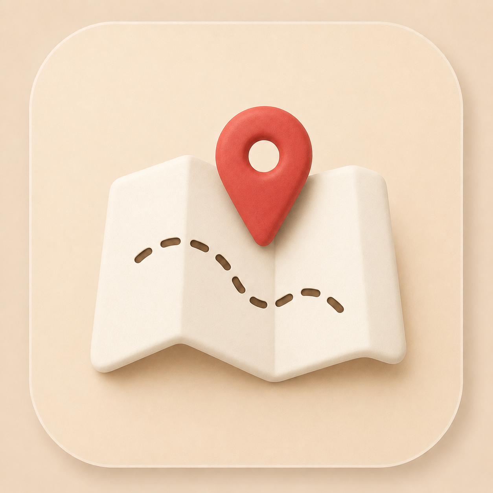
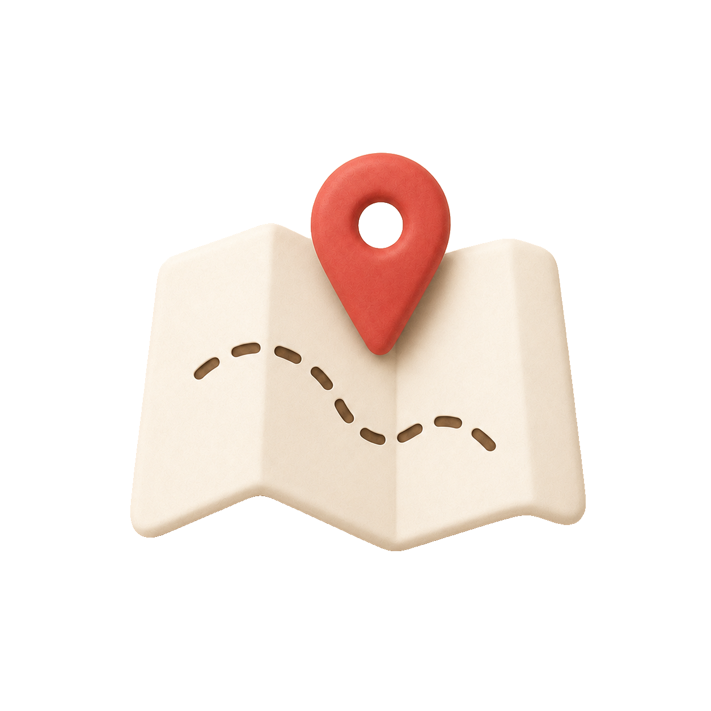

# 圖片去背小工具 🪄

把圖片去背,**只留中間主要元素**,背景全透明(輸出透明 PNG)。
用的是本機、免費、業界頂尖的去背模型 **BiRefNet**(透過 [rembg](https://github.com/danielgatis/rembg)),不需連網 API、不用金鑰、不花錢。

---

## 效果範例

| 原圖 | 去背後（透明 PNG） |
|------|------|
|  |  |
|  |  |

---

## 三種用法

### 方法 1：拖曳(最簡單）
把圖片或整個資料夾**拖到「去背工具.app」的圖示上**,放開就會自動去背,
結果會出現在「去背結果」資料夾並自動打開。

> ⚠️ 是「拖」到圖示上,不是 double-click。

### 方法 2：一鍵資料夾模式
1. 把要去背的圖片丟進「**輸入圖片**」資料夾
2. Double-click「**一鍵去背.command**」
3. 結果出現在「**去背結果**」資料夾

### 方法 3：命令列(進階/給 Claude 用)
```bash
# 單張或多張
.venv/bin/python remove_bg.py 圖片.png

# 整個資料夾
.venv/bin/python remove_bg.py "某資料夾/"

# 常用選項
.venv/bin/python remove_bg.py 圖.png --out 去背結果 --trim --matting
```

| 選項 | 說明 |
|------|------|
| `--out DIR` | 輸出資料夾(預設 `去背結果`) |
| `--model NAME` | 模型(預設 `birefnet-general`;**淡色/低對比主體被切掉**時改用 `isnet-general-use`) |
| `--fill` | **補洞**:填實主體內部被誤判為背景的封閉區域(線稿/實心圖示,如信封)。⚠️ 會一併填掉刻意鏤空的孔(齒輪中心、對話框三點),那類圖勿用 |
| `--largest` | 只留最大主體,清掉分離碎塊/浮動小裝飾 |
| `--trim` | 裁掉四周透明邊,只留主體外框(適合當貼圖) |
| `--matting` | 開啟 alpha matting,邊緣更細緻 |

---

## 支援格式
輸入:`png / jpg / jpeg / webp / bmp / tiff` → 輸出:透明 `png`

## 遇到去背不理想時,對症下藥
- **主體內部/下半部被挖空、缺角**(淡色、和背景太接近):改用 `--model isnet-general-use`。
- **線稿/空心圖示只剩外框、中間沒填滿**(如信封):加 `--fill`(必要時再配 `--largest`)。
- **背景殘留碎塊、浮動小圖案**:加 `--largest`。
- **邊緣毛躁**:加 `--matting`。

> 原理:去背只算出「哪裡是主體」的遮罩,再把它套回**原圖**;`--fill` 會把主體內部封閉的破洞補起來。
> 這是「顯著物件」去背,預設保留畫面中**最主要的主體**;多個分離元素可能只留最主要那個(可用 `--largest` 強制)。

**`--fill` 已知限制**:只補「四周被主體包圍」的封閉破洞;若破洞剛好貼到圖片邊緣(例如被裁切過的圖),補不到。遇到時可先把圖加一圈透明留白再跑。

## 環境（已建好，通常不用管）
- `.venv/`:Python 3.13 虛擬環境,已裝 `rembg / pillow / onnxruntime / scipy / numpy`
- 若 `.venv` 損壞,重建:
  ```bash
  python3 -m venv .venv
  .venv/bin/pip install -r requirements.txt
  ```
